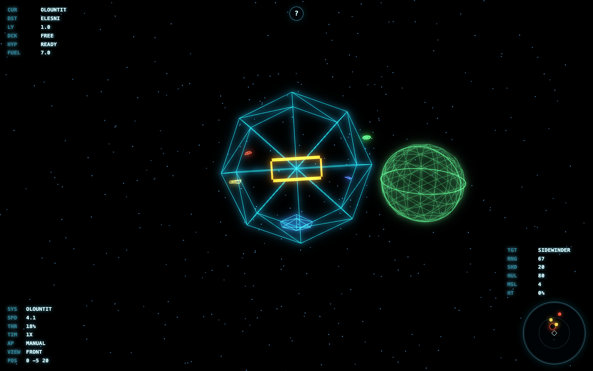

# Elite Front

A browser remake prototype of Elite built with TypeScript, Vite, and Babylon.js.
The current slice implements the core single-player loop: neon-vector rendering,
ship flight, trading, combat, docking, and hyperspace jumps between generated
systems.



## Features

- Procedural galaxy data with deterministic systems and station markets.
- Neon-vector scene rendering: starfield, planet, Coriolis station, and ships.
- Frontier-style Newtonian flight with throttle, inertia, retro-thrust,
  autopilot, time acceleration, and four classic view modes.
- Station market UI with credits, stock, cargo capacity, buy, and sell actions.
- Combat loop with target cycling, lasers, missiles, shield/hull damage, and radar.
- Auto-docking and hyperspace jumps to reachable systems.

## Controls

| Key | Action |
| --- | --- |
| `W` / `S` or arrow up/down | Pitch |
| `A` / `D` or arrow left/right | Yaw |
| `Q` / `E` | Roll |
| `Shift` / `Ctrl` | Throttle up/down |
| `+` / `-` | Step throttle up/down |
| `Backspace` | Retro-thrust brake |
| `1` / `2` / `3` / `4` | Front, rear, left, right view |
| `Space` | Fire laser |
| `R` | Cycle target |
| `M` | Fire missile |
| `T` | Toggle station market |
| `C` | Docking computer / launch |
| `B` | Toggle station autopilot |
| `Z` / `X` | Decrease/increase time acceleration |
| `J` | Hyperspace jump |
| `H` / `?` | Toggle keyboard help |
| `Esc` | Close market/help |

## Development

```sh
npm install
npm run dev
```

The dev server defaults to `http://localhost:5173/`.

## Verification

```sh
npm run typecheck
npm run build
```

Browser verification screenshots are generated locally under
`output/playwright/` and are intentionally ignored by git.

## Project Structure

- `src/world/` - deterministic galaxy, names, and system models.
- `src/render/` - Babylon scene composition and neon-vector meshes.
- `src/game/` - flight, economy, combat, and navigation controllers.
- `src/ui/` - DOM HUDs and trade panel.
